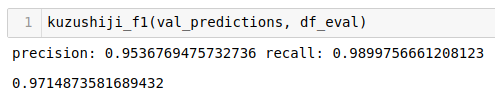
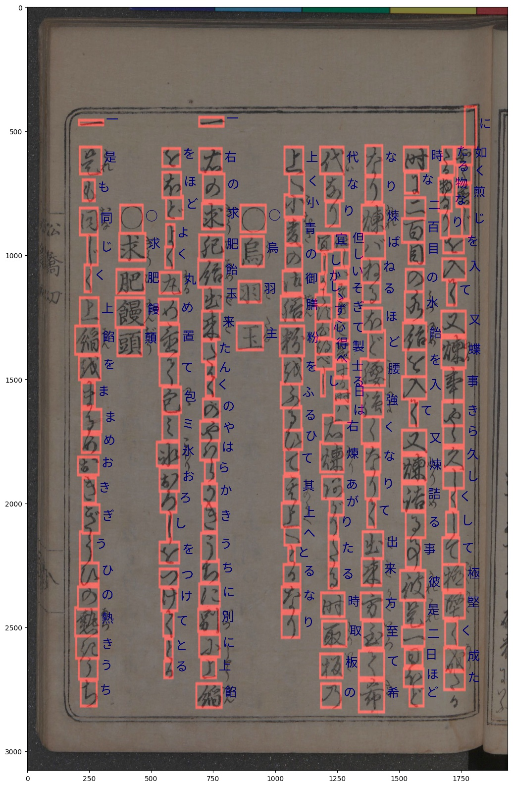

# Kuzushiji Recognition
[Late Submission] Solution for kuzushiji recognition (kaggle competition)

### Segmentation model

- Unet with custom resnet-based backbone

##### Evaluate on detection model



### Classification model

- Baseline model for kuzushiji character recognition

- Number of classes: 3422

### Command

- Clone repository

```python
git clone https://github.com/huyhoang17/kuzushiji_recognition
cd kuzushiji_recognition
```

- Install some prerequisite libs

```python
pip install -r requirements.txt
```

- Install `Git LFS` and pull model files, follow by this [tutorial](https://www.atlassian.com/git/tutorials/git-lfs#pulling-and-checking-out)

- Open kuzu_tfserving.config on editor, change `base_path` of 2 models to absolute path to each sub-folder

```bash
# change this line
base_path: '/home/phan.huy.hoang/workspace/projects/kaggle_kuzushiji/model_server/kuzu_segment'

# to
base_path: '/absolute-path-to-root-folder/model_server/kuzu_segment'
```

- Run tensorflow model server

```bash
tensorflow_model_server --port=8500 --rest_api_port=8501 --model_config_file=/absolute-path-to-kuzu-tfserving.config
```

- Test detection & recognition model

```bash
python3 src/grpc_infer.py
```

- Check result image in `assets` folder

### Result




### Contact

- hoangphan0710@gmail.com