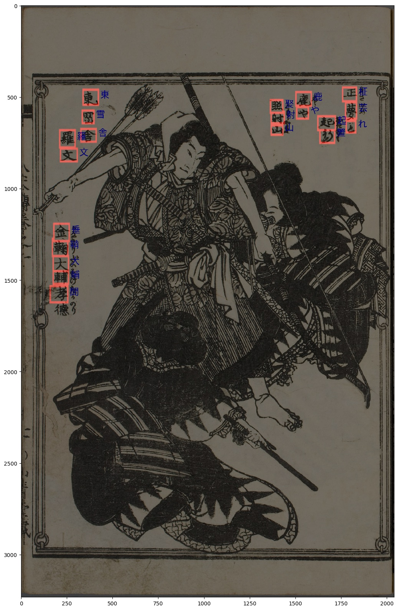
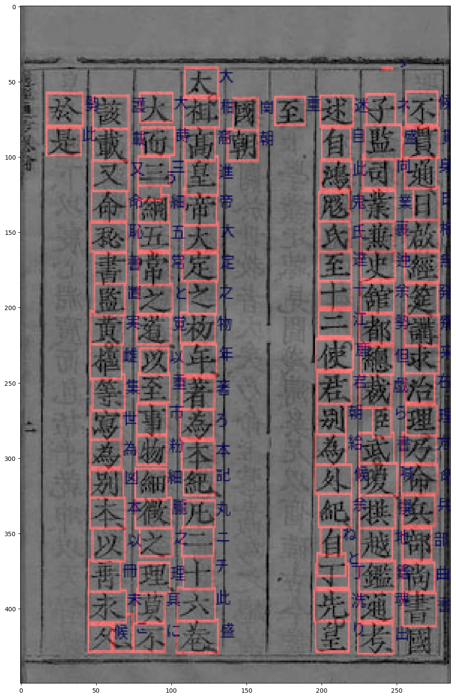
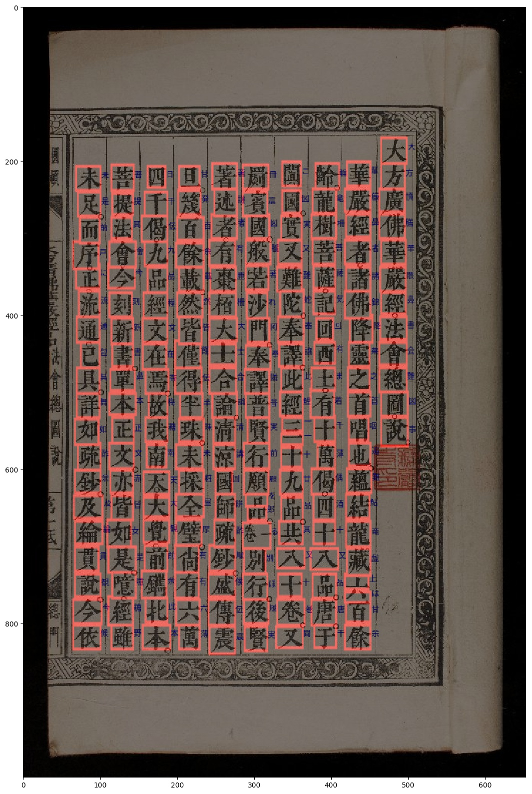
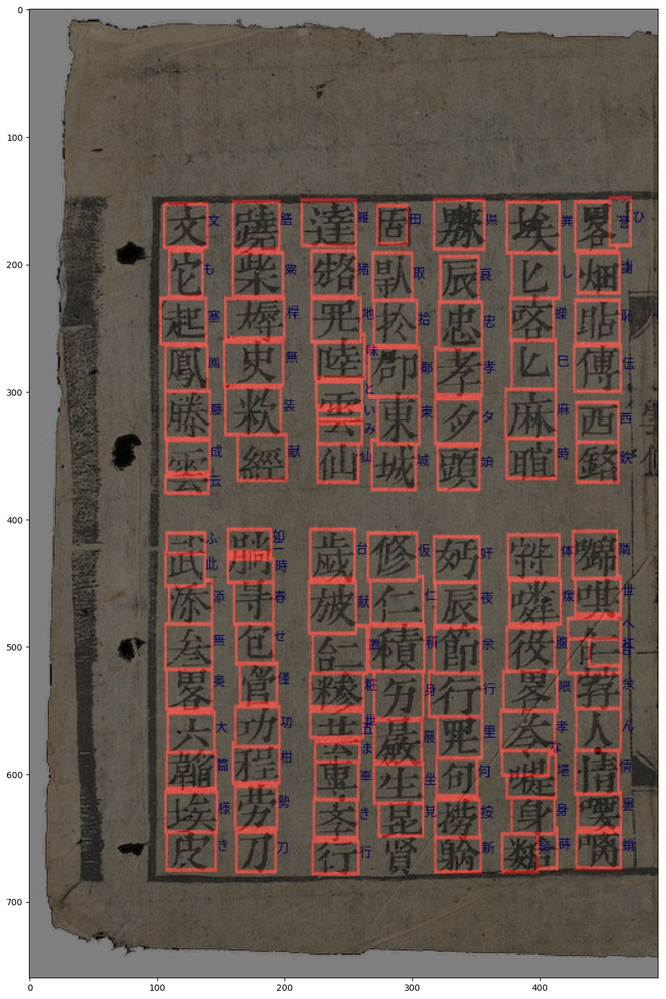

[](https://forthebadge.com)
[](https://www.python.org/)
[](https://github.com/huyhoang17/kuzushiji_recognition/)
[](https://forthebadge.com)

# Kuzushiji Recognition
[Late Submission] Solution for kuzushiji recognition (kaggle competition)

- Link blog post: [Building OCR module for Kuzushiji recognition](https://viblo.asia/p/V3m5WPngKO7)

### Segmentation model

- Unet with custom resnet-based backbone

##### Evaluate on detection model


### Classification model

- Baseline model for kuzushiji character recognition

- Number of classes: 3422

### Command

- Clone repository

```python
git clone https://github.com/huyhoang17/kuzushiji_recognition
cd kuzushiji_recognition
```

- Install some prerequisite libs

```python
pip install -r requirements.txt
```

- [Optional] Install `Git LFS` and pull model files, follow by this [tutorial](https://www.atlassian.com/git/tutorials/git-lfs#pulling-and-checking-out)

- Open kuzu_tfserving.config on editor, change `base_path` of 2 models to absolute path to each sub-folder

```bash
# change this line
base_path: '/home/phan.huy.hoang/workspace/projects/kaggle_kuzushiji/model_server/kuzu_segment'

# to
base_path: '/absolute-path-to-root-folder/model_server/kuzu_segment'
```

- Install `tensorflow_model_server` from this [link](https://www.tensorflow.org/tfx/serving/setup)

- Run tensorflow model server

```bash
tensorflow_model_server --port=8500 --rest_api_port=8501 --model_config_file=/absolute-path-to-kuzu-tfserving.config
```

- Test detection & recognition model

```bash
python3 src/grpc_infer.py
```

- Check result image in `assets` folder

### Result




### Result 2

- I tested on [Chữ_Nôm](https://en.wikipedia.org/wiki/Ch%E1%BB%AF_N%C3%B4m) and used pre-trained detection model from kuzushiji dataset

[Đại Việt sử ký toàn thư](http://www.nomfoundation.org/nom-project/history-of-greater-vietnam/Fulltext/70-Trang-Tong-Du-Hoang-De?uiLang=en)



[Chùa Thắng Nghiêm](https://lib.nomfoundation.org/collection/2/volume/1262/page/1)



[Lục Vân Tiên](http://www.nomfoundation.org/nom-project/Luc-Van-Tien/Luc-Van-Tien-Text/Luc-Van-Tien-Text?uiLang=en)



### TODO

- Add pytorch code

- Update docker / docker-compose

### Contact

- If you find this repo useful, please star the project to let people know that it's reliable :star::star::star: Thank you!

- For more information, please contact me at email address: hoangphan0710@gmail.com
